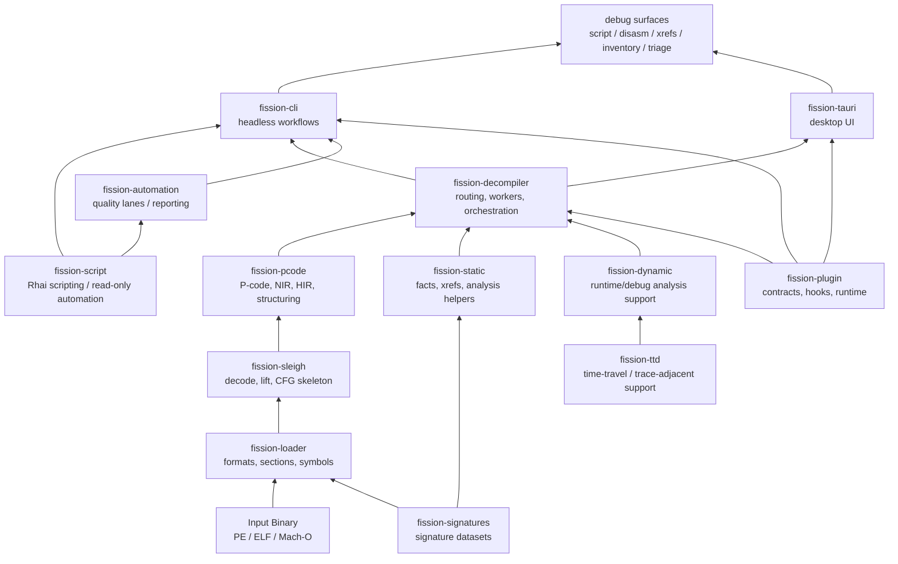
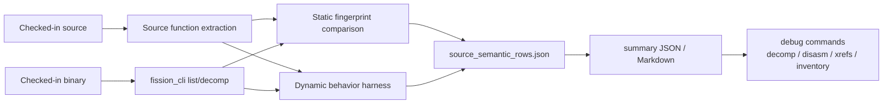

# Fission


[](https://github.com/sjkim1127/Fission/actions/workflows/ci.yml)
[](https://www.rust-lang.org/)
[](https://www.gnu.org/licenses/agpl-3.0.html)

**Fission** is a high-performance, Rust-native reverse-engineering and decompilation framework designed for precision binary analysis at scale.

> [!TIP]
> New to the project? Build `fission_cli`, run the `First 10 Minutes` commands, then open the generated source-semantic summary before diving into the full architecture docs.

## Overview

Fission represents a fundamental rearchitecture of decompilation workflows, placing Rust at the core of:

- **Instruction Semantics**: Precision lift via Sleigh, with semantics-preserving IR normalization
- **Canonical Intermediate Representation**: NIR/HIR layers ensuring deterministic, auditable transformations
- **Control-Flow Recovery**: Graph-based structuring with algorithmic soundness
- **Pseudocode Rendering**: Type-aware, context-sensitive output generation

Fission pursues **independent decompilation excellence** with Ghidra available as a benchmarking and validation reference.

### Key Principles

- **Correctness-first**: Unsafe decompilation (even with high precision) fails closed to fallback modes
- **Deterministic**: All output feeds reproducible snapshots, metrics, and CI validation
- **Auditable**: Every transformation step is tracked, logged, and verifiable
- **Modular**: Each layer (lift → IR → structure → render) owns its contract independently

License: AGPL-3.0-or-later. Contributions welcome under the CLA in [`CLA.md`](./CLA.md).

---

## System Architecture



> [!IMPORTANT]
> Semantic recovery and structuring belong to the IR layer. CLI, GUI, scripting, debugger/trace surfaces, plugins, and report writers consume those results; they should not repair or reinterpret decompiler semantics after the fact.

For deeper visual maps, see [`docs/architecture/DIAGRAMS.md`](./docs/architecture/DIAGRAMS.md).

### Core Components

| Component | Role | Ownership |
|-----------|------|-----------|
| **fission-sleigh** | Instruction decode, lift semantics, CFG skeleton | Sleigh layer |
| **fission-pcode** | Canonical IR, NIR/HIR, structuring, CFG analysis, pseudocode printer | IR / structure layers |
| **fission-static** | Static facts, native helpers, analysis services | Analysis layer |
| **fission-decompiler** | Orchestration, routing/workers, Rust-Sleigh bridge (re-exports `fission_pcode`) | Workflow layer |
| **fission-loader** | Binary format parsing, symbols, sections, strings | Binary layer |
| **fission-signatures** | Function signatures, type signatures, identifier data | Data layer |
| **fission-script** | Embedded Rhai scripting for read-only binary automation | Scripting layer |
| **fission-dynamic** | Dynamic analysis and debugger-adjacent support | Runtime analysis layer |
| **fission-ttd** | Time-travel / trace-adjacent support | Trace layer |
| **fission-plugin** | Plugin contracts, hooks, and runtime extension points | Extension layer |
| **fission-automation** | Quality lanes, regression testing, telemetry reporting | Quality layer |
| **fission-cli** | Headless CLI (one-shot subcommands), Rhai `script`, operator `inventory` | Product layer |
| **fission-tauri** | Desktop GUI, interactive analysis, visualization | Product layer |

---

## Documentation Hub

Fission maintains comprehensive, role-based documentation:

| Start here if you want to... | Read |
|---|---|
| understand the repository layout | [`docs/PROJECT_MAP.md`](./docs/PROJECT_MAP.md) |
| understand architecture and ownership rules | [`docs/architecture/ARCHITECTURE.md`](./docs/architecture/ARCHITECTURE.md) and [`docs/architecture/DIAGRAMS.md`](./docs/architecture/DIAGRAMS.md) |
| run the CLI as an external evaluator | [`docs/EVALUATION.md`](./docs/EVALUATION.md) and [`docs/CLI.md`](./docs/CLI.md) |
| run canonical source-vs-Fission quality checks | [`benchmark/source_semantic_benchmark/README.md`](./benchmark/source_semantic_benchmark/README.md) |
| run focused semantic shape canaries | [`benchmark/source_semantic_benchmark/FEATURE_SHAPE_CANARIES.md`](./benchmark/source_semantic_benchmark/FEATURE_SHAPE_CANARIES.md) |
| compare against Ghidra reference workflows | [`benchmark/full_benchmark/README.md`](./benchmark/full_benchmark/README.md) |
| contribute safely | [`CONTRIBUTING.md`](./CONTRIBUTING.md), [`AGENTS.md`](./AGENTS.md), [`CLA.md`](./CLA.md) |

Additional references:

- [Wiki Home](https://github.com/sjkim1127/Fission/wiki) — Tutorials, guides, FAQ
- [`wiki/DOCUMENTATION_HUB.md`](./wiki/DOCUMENTATION_HUB.md) — Wiki vs repository doc split; mirrors the GitHub Wiki documentation hub
- [`docs/onboarding/FIRST_30_MINUTES.md`](./docs/onboarding/FIRST_30_MINUTES.md) — Contributor-oriented first-session checklist
- [`docs/VERSIONING.md`](./docs/VERSIONING.md) and [`docs/RELEASE.md`](./docs/RELEASE.md) — Versioning and release process
- [`THIRD_PARTY.md`](./THIRD_PARTY.md) and [`SECURITY.md`](./SECURITY.md) — Third-party provenance and disclosure/sample-handling expectations
- [`docs/changelog/Legacy/`](./docs/changelog/Legacy/) — Archived dated development logs and historical release notes

---

## Current Capabilities

### Decompilation Paths

| Path | Status | Coverage | Notes |
|------|--------|----------|-------|
| **NIR (Rust-native)** | Primary | PE x64, ARM64 | Canonical Rust architecture path |

### Supported Binary Formats

- **PE** (Windows x86, x64, ARM64) — Full support
- **ELF** (Linux x86, x64, ARM, ARM64) — Core support
- **Mach-O** (macOS x64, ARM64) — Experimental

### Project Maturity Status

**Solid & Production-Ready:**
- ✅ Headless CLI (`fission_cli`: subcommands, JSON/automation paths, `inventory`, Rhai `script`)
- ✅ Rust-native decompilation pipeline
- ✅ Quality assurance and regression testing
- ✅ Automated source-semantic benchmarking against checked-in original source
- ✅ Focused feature-shape canaries for pointer/array, control-flow, constants, calls, and global side effects
- ✅ Deterministic, reproducible output

**In Active Development:**
- 🔄 Large function readability and precision
- 🔄 SLEIGH ConstructTpl lift completeness and compatibility-debt removal
- 🔄 Advanced data abstraction: structures, pointers, arrays, field access, calling convention, parameter, and local recovery
- 🔄 Rich type inference, FID, signature, and name recovery
- 🔄 Dynamic/debugger and TTD-adjacent workflows
- 🔄 Desktop UI polish and end-user experience
- 🔄 Additional architecture targets (MIPS, PPC, etc.)

> [!NOTE]
> PE x64 has the strongest direct NIR coverage. Other architectures and formats are development targets and should not be treated as equivalent production-quality claims.

---

## Repository Layout

### Core Decompiler Modules

| Crate | Responsibility | Key Artifacts |
|-------|-----------------|----------------|
| [`crates/fission-sleigh`](./crates/fission-sleigh) | Instruction decode, semantics lift, CFG skeleton | Sleigh bindings, lift contracts |
| [`crates/fission-pcode`](./crates/fission-pcode) | Canonical IR, NIR/HIR, structuring, CFG analysis, printing | P-Code IR, graph reduction, pseudocode output |
| [`crates/fission-static`](./crates/fission-static) | Static fact generation, prepare helpers, analysis | Dominance, SCC, value analysis |
| [`crates/fission-decompiler`](./crates/fission-decompiler) | Orchestration, routing/workers, Rust-Sleigh glue | End-to-end workflow |

### Supporting Modules

| Crate | Responsibility |
|-------|-----------------|
| [`crates/fission-loader`](./crates/fission-loader) | Binary loading, symbol extraction, section parsing |
| [`crates/fission-signatures`](./crates/fission-signatures) | Function/type signatures, identifier resolution |
| [`crates/fission-script`](./crates/fission-script) | Embedded Rhai scripting for read-only binary automation |
| [`crates/fission-core`](./crates/fission-core) | Core data structures |
| [`crates/fission-dynamic`](./crates/fission-dynamic) | Dynamic analysis and debugger-adjacent support |
| [`crates/fission-ttd`](./crates/fission-ttd) | Time-travel / trace-adjacent support |
| [`crates/fission-plugin`](./crates/fission-plugin) | Plugin contracts, hooks, and runtime extension points |

### Product Surfaces

| Crate | Purpose |
|-------|---------|
| [`crates/fission-cli`](./crates/fission-cli) | Headless one-shot CLI and operator workflows |
| [`crates/fission-tauri`](./crates/fission-tauri) | Cross-platform desktop GUI |
| [`crates/fission-automation`](./crates/fission-automation) | Quality lanes, test automation, CI/CD integration |

---

## Quick Start

### Prerequisites

- **Rust** 1.85+ ([install](https://www.rust-lang.org/tools/install))
- **Cargo** (bundled with Rust)
- C++ compiler (for some dependencies)

### Build the CLI

```bash
git clone https://github.com/sjkim1127/Fission.git
cd Fission
cargo build -p fission-cli --release
```

The compiled binary is available at: `target/release/fission_cli`

### Basic Usage

```bash
# Display binary information
./target/release/fission_cli info <binary>

# Decompile a single function at address
./target/release/fission_cli decomp <binary> --addr <address>

# List discovered functions
./target/release/fission_cli list <binary> --json

# Batch decompilation with limits
./target/release/fission_cli decomp <binary> --all --limit 100

# Operator-facing inventory
./target/release/fission_cli inventory function-facts <binary> --json
```

### First 10 Minutes

After building `fission_cli`, run one manual CLI check and one source-semantic canary:

```bash
# 1. Inspect a checked-in sample binary
./target/release/fission_cli info \
  benchmark/binary/x86-64/window/small/binary/c/test_functions.exe

# 2. Run the focused source-semantic feature-shape canary
python3 benchmark/source_semantic_benchmark/run_source_semantic_benchmark.py \
  --manifest benchmark/source_semantic_benchmark/manifests/feature_shape_canaries.json \
  --fission-bin target/release/fission_cli \
  --timeout-sec 45 \
  --jobs 1 \
  --output-dir benchmark/artifacts/source_semantic_benchmark/feature-shape-canaries-latest
```

Open `benchmark/artifacts/source_semantic_benchmark/feature-shape-canaries-latest/source_semantic_summary.md` for the first quality snapshot.

Legacy flat invocations still work for one transition period, but canonical
usage is now subcommand-based.

For the full command model, subcommand ownership, operator inventory workflows,
JSON guidance, and legacy compatibility rules, see
[`docs/CLI.md`](./docs/CLI.md).

If you are evaluating Fission externally and want the shortest CLI-first path,
use [`docs/EVALUATION.md`](./docs/EVALUATION.md). That guide is opinionated,
Windows x64-first, and includes checked-in sample binaries plus example output
payloads.

Library-level use is possible at the Rust crate level, but the CLI is the
current primary documented product surface.

If you want benchmark evaluation rather than a first manual CLI pass, use the
canonical source-semantic workflow in
[`benchmark/source_semantic_benchmark/README.md`](./benchmark/source_semantic_benchmark/README.md).
The Ghidra benchmark remains available as a reference/comparison lane, not as
the primary quality oracle.

### Run the Desktop GUI

The desktop application lives in [`crates/fission-tauri`](./crates/fission-tauri)
and uses Tauri + Vite for the UI shell.

```bash
# Install GUI frontend dependencies once
cd crates/fission-tauri
npm install

# Launch the desktop GUI in development mode
npm run tauri -- dev
```

For a production desktop build:

```bash
cd crates/fission-tauri
npm run tauri -- build
```

### Run Quality Assurance

Execute the main quality lane for regression testing:

```bash
cargo run -p fission-automation -- nir-check --lane nir
```

### Build All Products

```bash
# Release build (optimized)
cargo build --release

# Desktop GUI shell
cd crates/fission-tauri
npm run tauri -- build

# Full test suite
cargo test --all
```

---

## Engineering Status

### Production-Ready Components ✅

- **Decompilation Pipeline**: Full Rust-native NIR/HIR path with deterministic output
- **Command-Line Interface**: One-shot subcommands with JSON/inventory surfaces and optional Rhai `script` (no interactive REPL or TUI in `fission-cli`)
- **Quality Assurance**: Integrated regression testing, source-semantic benchmarking, and focused feature-shape canaries
- **Binary Support**: PE x64 (primary), ELF x64/ARM64, Mach-O (experimental)
- **Telemetry**: Built-in metrics, statistics, and CI/CD reporting

### Active Development Areas 🔄

| Area | Target | Timeline |
|------|--------|----------|
| **SLEIGH Lift Accuracy** | Complete ConstructTpl execution as the success source; remove legacy token cursor, BoundOperand fallback, and compatibility classifier debt | Q2 2026 |
| **Type/Data Abstraction** | Structures, pointers, arrays, field access, calling convention, parameter, and local recovery | Q2 2026 |
| **Large Function Handling** | >10K instruction functions | Q2 2026 |
| **Name Recovery** | FID, signatures, symbols, and identifier inference | Q3 2026 |
| **Dynamic / TTD Workflows** | Debugger-adjacent analysis, trace surfaces, plugin-facing runtime hooks | Q3 2026 |
| **UI/UX Polish** | Desktop workflow optimization | Q3 2026 |
| **Additional Targets** | MIPS, PPC, additional architectures | Q4 2026 |

### Known Limitations

- Large functions (>10K instructions) may produce simplified output
- Advanced type/data abstraction patterns in progress
- FID/name recovery is partial, especially packed `.fidb`, exact hash inputs, and broad program seeker coverage
- Limited cross-architecture coverage (PE x64 is primary target)
- Dynamic/debugger and TTD-adjacent workflows are under active development
- Desktop UI is functional but undergoing refinement

---

## Advanced Usage

### Source Semantic Benchmark



For canonical decompilation-quality analysis against checked-in original source:

```bash
python3 benchmark/source_semantic_benchmark/run_source_semantic_benchmark.py \
  --manifest benchmark/source_semantic_benchmark/manifests/smoke_windows_small_c.json \
  --fission-bin target/release/fission_cli \
  --output-dir benchmark/artifacts/source_semantic_benchmark/smoke-latest
```

For a smaller advisory canary that focuses on semantic feature shapes such as
pointer/array side effects, matrix writes, swaps, switch/loop control flow,
constants, calls, and global sink behavior:

```bash
python3 benchmark/source_semantic_benchmark/run_source_semantic_benchmark.py \
  --manifest benchmark/source_semantic_benchmark/manifests/feature_shape_canaries.json \
  --fission-bin target/release/fission_cli \
  --timeout-sec 45 \
  --jobs 1 \
  --output-dir benchmark/artifacts/source_semantic_benchmark/feature-shape-canaries-latest
```

Use the feature-shape canary before the full source-owned corpus when you want a
fast first-pass answer to: "did this change break a recognizable semantic
shape?" For triage-heavy runs, see
[`benchmark/source_semantic_benchmark/FEATURE_SHAPE_CANARIES.md`](./benchmark/source_semantic_benchmark/FEATURE_SHAPE_CANARIES.md).

### Which Benchmark Should I Run?

| Suite | Use when | Oracle | Expected cost |
|---|---|---|---|
| `smoke_windows_small_c.json` | fastest source-semantic sanity check | checked-in source | low |
| `feature_shape_canaries.json` | checking recognizable semantic shapes | checked-in source + behavior cases | low/medium |
| `source_owned_all.json` | broad source-owned corpus validation | checked-in source | medium/high |
| full benchmark | investigating Ghidra reference parity | Ghidra comparison | high |

> [!IMPORTANT]
> Source semantic benchmark rows compare Fission output against checked-in source-derived fingerprints and behavior harnesses. Ghidra is a reference/comparison lane, not the primary quality oracle.

Canonical benchmark config and artifacts now live under:

- [`benchmark/source_semantic_benchmark/manifests/`](./benchmark/source_semantic_benchmark/manifests/)
- [`benchmark/artifacts/source_semantic_benchmark/`](./benchmark/artifacts/source_semantic_benchmark/)
- [`benchmark/artifacts/automation/`](./benchmark/artifacts/automation/)

### Inspect Quality Reports

Automated quality metrics are stored in:

```
benchmark/artifacts/automation/          # Fast-lane test results
benchmark/artifacts/source_semantic_benchmark/ # Canonical source semantic runs
benchmark/artifacts/full_benchmark/      # Ghidra reference/comparison runs
```

### Extended Architecture

For detailed system design, read [`docs/architecture/ARCHITECTURE.md`](./docs/architecture/ARCHITECTURE.md) and [`docs/architecture/DIAGRAMS.md`](./docs/architecture/DIAGRAMS.md).

---

## User Interface

### Desktop Application

The Fission desktop GUI provides an integrated analysis environment:

**Main Workspace**


**Decompilation View**


Features:
- Interactive function browser with call graphs
- Real-time decompilation with syntax highlighting
- Symbol resolution and type inference
- Batch analysis and report generation
- Cross-reference navigation

---

## Contributing

Fission welcomes contributions from the reverse-engineering and decompilation communities.

### Getting Started

1. Review [`CONTRIBUTING.md`](./CONTRIBUTING.md) for guidelines
2. Sign the Contributor License Agreement ([`CLA.md`](./CLA.md))
3. Check [`AGENTS.md`](./AGENTS.md) for code organization and conventions
4. Open an issue to discuss your proposed changes

### Contribution Areas

- **Instruction Semantics**: Accuracy improvements for Sleigh lifts
- **IR Transformations**: New optimizations and normalization passes
- **Structuring Algorithms**: Control-flow recovery improvements
- **Binary Format Support**: Additional architectures and formats
- **Testing & Benchmarking**: Quality metrics and regression detection
- **Documentation**: Tutorials, guides, and architectural documentation

---

## Community & Support

### Communication

- **Issues & Discussions**: [GitHub Issues](https://github.com/sjkim1127/Fission/issues)
- **Discord Community**: [Join our server](https://discord.gg/dgzqGwBpcE)
- **Social Media**: [LinkedIn](https://www.linkedin.com/in/sung-joo-kim-718a93303/)

### Learning Resources

- [Reverse-Engineering Workflows Wiki](https://github.com/sjkim1127/Fission/wiki/Reverse-Engineering-Workflows)
- [Contributor Onboarding](https://github.com/sjkim1127/Fission/wiki/Contributor-Onboarding)
- [Troubleshooting Guide](https://github.com/sjkim1127/Fission/wiki/Troubleshooting)
- [FAQ](https://github.com/sjkim1127/Fission/wiki/FAQ)

---

## Vision & Long-Term Direction

Fission is architected for **project-level software restoration** — not just decompilation.

### Current Focus (2026)
✅ High-precision decompilation for PE x64  
✅ Deterministic, auditable analysis pipelines  
✅ Measurable quality metrics and benchmarking  

### Medium-Term (2026-2027)
🔄 Expanded architecture support  
🔄 Advanced data abstraction and memory modeling  
🔄 Integrated static/dynamic analysis workflows  
🔄 Semantic-aware type recovery  

### Long-Term Vision (2027+)
🎯 Project-level program comprehension  
🎯 Cross-function fact accumulation  
🎯 AI-assisted analysis on verified artifacts  
🎯 Protocol-facing and behavioral analysis integration  
🎯 Commercial-grade analysis platform  

### Design Philosophy

Rather than building a thin UI over existing decompilers, Fission pursues **independent decompilation excellence** with:

- **Algorithmic Soundness**: Graph-based, mathematically rigorous transformations
- **Auditability**: Every decision is verifiable and reproducible
- **Modularity**: Clean separation of concerns across layers
- **Quality Focus**: Metrics and regression detection as first-class citizens
- **Long-term Maintenance**: Sustainable, understandable codebase

---

## License & Citation

```
SPDX-License-Identifier: AGPL-3.0-or-later
```

**License**: GNU Affero General Public License v3.0 or later  
See [`LICENSE`](./LICENSE) for full text

### Citation

If you use Fission in academic work, please cite:

```bibtex
@software{fission2026,
  title={Fission: A Rust-Native Decompilation Framework},
  author={Kim, Sung Joo},
  year={2026},
  url={https://github.com/sjkim1127/Fission}
}
```

---

## Acknowledgments

Fission builds upon decades of decompilation research and engineering. Special acknowledgment to:

- **Ghidra** — Reference architecture, semantic lifting, benchmarking
- **RetDec** — Decompilation techniques and IR design
- **Radare2** — Analysis ecosystem and tooling inspiration
- **LLVM** — Compiler infrastructure and optimization patterns
- The reverse-engineering research community
