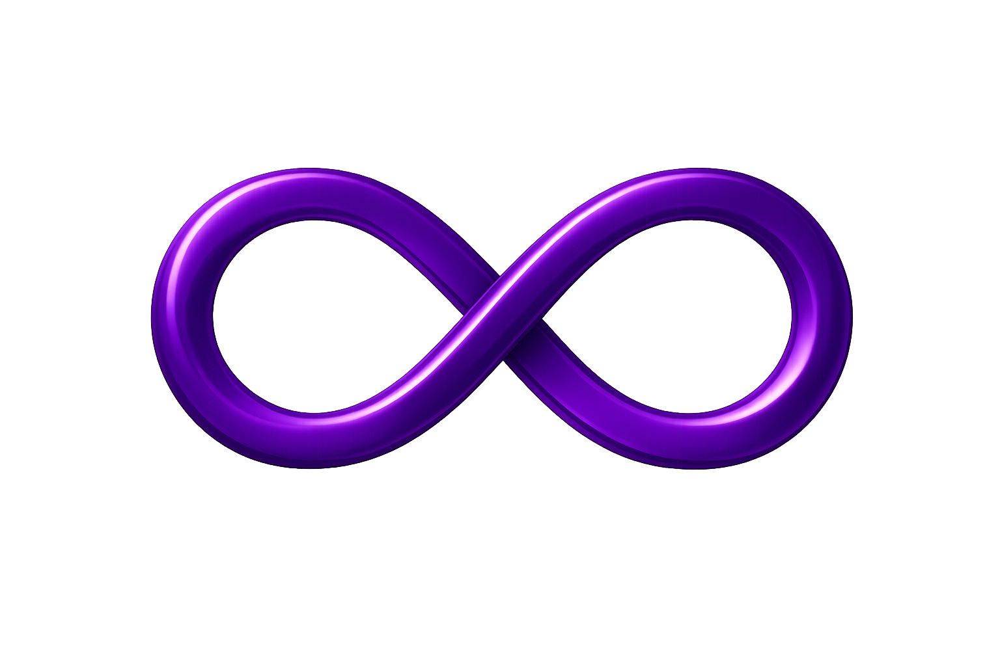
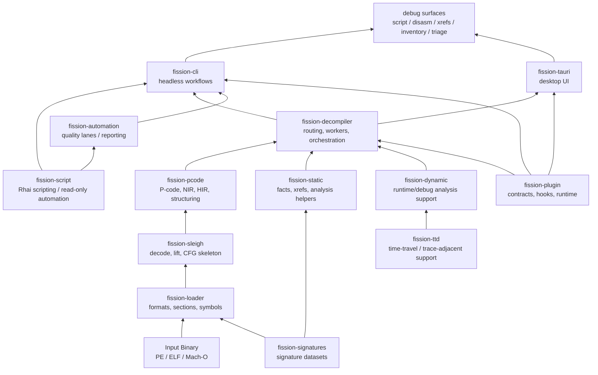
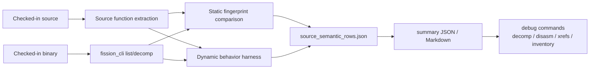
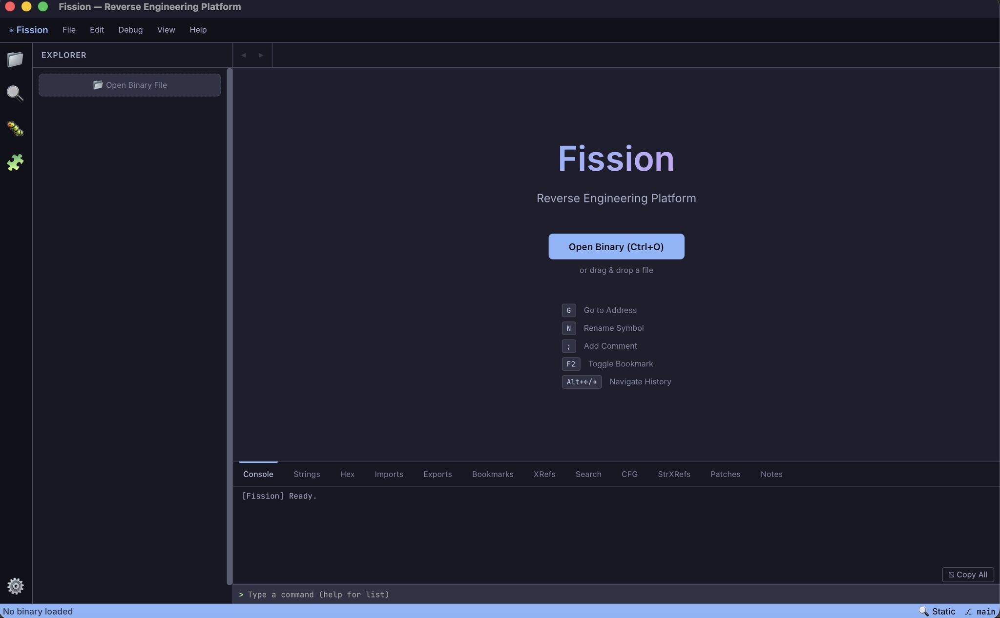
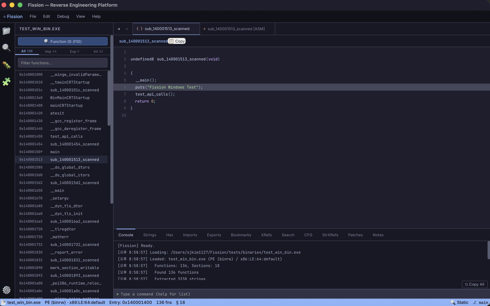

# Fission



[](https://github.com/sjkim1127/Fission/actions/workflows/ci.yml)
[](https://www.rust-lang.org/)
[](https://www.gnu.org/licenses/agpl-3.0.html)

**Fission** is a high-performance, Rust-native reverse-engineering and decompilation framework designed for precision binary analysis at scale.

> [!TIP]
> New to the project? Build `fission_cli`, run the `First 10 Minutes` commands, then open the generated source-semantic summary before diving into the full architecture docs.

## Overview

Fission represents a fundamental rearchitecture of decompilation workflows, placing Rust at the core of:

- **Instruction Semantics**: Precision lift via Sleigh, with semantics-preserving IR normalization
- **Canonical Intermediate Representation**: NIR/HIR layers ensuring deterministic, auditable transformations
- **Control-Flow Recovery**: Graph-based structuring with algorithmic soundness
- **Pseudocode Rendering**: Type-aware, context-sensitive output generation

Fission pursues **independent decompilation excellence** with Ghidra available as a benchmarking and validation reference.

### Key Principles

- **Correctness-first**: Unsafe decompilation (even with high precision) fails closed to fallback modes
- **Deterministic**: All output feeds reproducible snapshots, metrics, and CI validation
- **Auditable**: Every transformation step is tracked, logged, and verifiable
- **Modular**: Each layer (lift → IR → structure → render) owns its contract independently

License: AGPL-3.0-or-later. Contributions welcome under the CLA in [`CLA.md`](./CLA.md).

---

## System Architecture



> [!IMPORTANT]
> Semantic recovery and structuring belong to the IR layer. CLI, GUI, scripting, debugger/trace surfaces, plugins, and report writers consume those results; they should not repair or reinterpret decompiler semantics after the fact.

For deeper visual maps, see [`docs/architecture/DIAGRAMS.md`](./docs/architecture/DIAGRAMS.md).

### Core Components

| Component | Role | Ownership |
|-----------|------|-----------|
| **fission-sleigh** | Instruction decode, lift semantics, CFG skeleton | Sleigh layer |
| **fission-pcode** | Canonical IR, NIR/HIR, structuring, CFG analysis, pseudocode printer | IR / structure layers |
| **fission-static** | Static facts, native helpers, analysis services | Analysis layer |
| **fission-decompiler** | Orchestration, routing/workers, Rust-Sleigh bridge (re-exports `fission_pcode`) | Workflow layer |
| **fission-loader** | Binary format parsing, symbols, sections, strings | Binary layer |
| **fission-signatures** | Function signatures, type signatures, identifier data | Data layer |
| **fission-script** | Embedded Rhai scripting for read-only binary automation | Scripting layer |
| **fission-dynamic** | Dynamic analysis and debugger-adjacent support | Runtime analysis layer |
| **fission-ttd** | Time-travel / trace-adjacent support | Trace layer |
| **fission-plugin** | Plugin contracts, hooks, and runtime extension points | Extension layer |
| **fission-ai** | AI provider orchestration, Codex OAuth & GitHub Copilot auth integrations | AI layer |
| **fission-automation** | Quality lanes, regression testing, telemetry reporting | Quality layer |
| **fission-cli** | Headless CLI (one-shot subcommands), Rhai `script`, operator `inventory` | Product layer |
| **fission-tauri** | Desktop GUI, interactive analysis, visualization | Product layer |
---

## Documentation Hub

Fission maintains comprehensive, role-based documentation:

| Start here if you want to... | Read |
|---|---|
| understand the repository layout | [`docs/PROJECT_MAP.md`](./docs/PROJECT_MAP.md) |
| understand architecture and ownership rules | [`docs/architecture/ARCHITECTURE.md`](./docs/architecture/ARCHITECTURE.md) and [`docs/architecture/DIAGRAMS.md`](./docs/architecture/DIAGRAMS.md) |
| run the CLI as an external evaluator | [`docs/EVALUATION.md`](./docs/EVALUATION.md) and [`docs/CLI.md`](./docs/CLI.md) |
| run canonical source-vs-Fission quality checks | [`benchmark/source_semantic_benchmark/README.md`](./benchmark/source_semantic_benchmark/README.md) |
| run focused semantic shape canaries | [`benchmark/source_semantic_benchmark/FEATURE_SHAPE_CANARIES.md`](./benchmark/source_semantic_benchmark/FEATURE_SHAPE_CANARIES.md) |
| compare against Ghidra reference workflows | [`benchmark/full_benchmark/README.md`](./benchmark/full_benchmark/README.md) |
| contribute safely | [`CONTRIBUTING.md`](./CONTRIBUTING.md), [`AGENTS.md`](./AGENTS.md), [`CLA.md`](./CLA.md) |

Additional references:

- [Wiki Home](https://github.com/sjkim1127/Fission/wiki) — Tutorials, guides, FAQ
- [`wiki/DOCUMENTATION_HUB.md`](./wiki/DOCUMENTATION_HUB.md) — Wiki vs repository doc split; mirrors the GitHub Wiki documentation hub
- [`docs/onboarding/FIRST_30_MINUTES.md`](./docs/onboarding/FIRST_30_MINUTES.md) — Contributor-oriented first-session checklist
- [`docs/VERSIONING.md`](./docs/VERSIONING.md) and [`docs/RELEASE.md`](./docs/RELEASE.md) — Versioning and release process
- [`THIRD_PARTY.md`](./THIRD_PARTY.md) and [`SECURITY.md`](./SECURITY.md) — Third-party provenance and disclosure/sample-handling expectations
- [`docs/changelog/Legacy/`](./docs/changelog/Legacy/) — Archived dated development logs and historical release notes

---

## Current Capabilities

### Decompilation Paths

| Path | Status | Coverage | Notes |
|------|--------|----------|-------|
| **NIR (Rust-native)** | Primary | PE x64, ARM64 | Canonical Rust architecture path |

### Supported Binary Formats

- **PE** (Windows x86, x64, ARM64) — Full support
- **ELF** (Linux x86, x64, ARM, ARM64) — Core support
- **TE** (UEFI Terse Executable) — Core support
- **Mach-O** (macOS x64, ARM64) — Experimental

### Project Maturity Status

**Solid & Production-Ready:**
- ✅ Headless CLI (`fission_cli`: subcommands, JSON/automation paths, `inventory`, Rhai `script`)
- ✅ Rust-native decompilation pipeline
- ✅ Quality assurance and regression testing
- ✅ Automated source-semantic benchmarking against checked-in original source
- ✅ Focused feature-shape canaries for pointer/array, control-flow, constants, calls, and global side effects
- ✅ Pure SLA-native SLEIGH Lift engine supporting all 146 Ghidra processor specifications (with zero-allocation pooling and path backtraces)
- ✅ Deterministic, reproducible output

**In Active Development:**
- 🔄 Large function readability and precision
- 🔄 Advanced data abstraction: structures, pointers, arrays, field access, calling convention, parameter, and local recovery
- 🔄 Rich type inference, FID, signature, and name recovery
- 🔄 AI-assisted reverse engineering and decompilation workflows (early-stage Codex & Copilot auth integrations)
- 🔄 Dynamic/debugger and TTD-adjacent workflows
- 🔄 Desktop UI polish and end-user experience

> [!NOTE]
> PE x64 has the strongest direct NIR coverage. Other architectures and formats are development targets and should not be treated as equivalent production-quality claims.

---

## Fission vs. Ghidra Parity Benchmarks

Fission uses Ghidra as a clean-room reference for validation. Below are actual, unexaggerated benchmark results from running the whole-binary decompilation quality comparison suite (`benchmark/full_benchmark/full_decomp_benchmark.py`) with the prebuilt `fission_cli` (release profile) and Ghidra (version 12.0.4).

### Benchmark Metrics

The benchmark measures **Avg Normalized Similarity** of the generated pseudocode strings using deterministic string alignment and token comparison algorithms.

| Binary | Platform / Arch | Shared Functions Compared | Avg Normalized Similarity | Fission Success Rate |
| :--- | :--- | :---: | :---: | :---: |
| **fauxware** | ELF / i386 (32-bit Linux) | 5 / 5 | **53.77%** | **100%** (5/5) |
| **bitops_and_control_flow.exe** | PE / x86-64 (64-bit Windows) | 10 / 10 | **61.12%** | **100%** (10/10) |

### Detailed Function-Level Similarity

#### Target: `fauxware` (i386 ELF)
- **`frame_dummy`**: **75.61%**
- **`_init`**: **54.66%**
- **`_start`**: **50.24%**
- **`authenticate`**: **50.13%**
- **`__do_global_dtors_aux`**: **38.19%**

#### Target: `bitops_and_control_flow.exe` (x86-64 PE)
- **`__gcc_register_frame`**: **88.44%**
- **`__gcc_deregister_frame`**: **83.33%**
- **`WinMainCRTStartup`**: **68.89%**
- **`mainCRTStartup`**: **68.18%**
- **`bit_reverse`**: **60.87%**
- **`__mingw_invalidParameterHandler`**: **55.88%**
- **`atexit`**: **49.18%**
- **`find_first_set_bit`**: **48.33%**
- **`popcount`**: **48.30%**
- **`__tmainCRTStartup`**: **39.83%**

### Analysis of the Similarity Gap
While Fission succeeds in 100% control-flow and structured block recovery for these functions, the ~40-60% similarity gap stems from:
1. **Name & Type Recovery**: Fission's local variable name generation (e.g., generic names like `local_1c` vs. Ghidra's custom types/names) and function signature recovery.
2. **Variable/Stack Merging**: Minor differences in how multi-SSA variables are merged compared to Ghidra's `HighVariable` merger.
3. **Literal Formatting**: Differences in constant folding and hex/decimal representations.

### Actual Decompilation Output Comparison

Here are side-by-side pseudocode comparisons demonstrating Fission's current capabilities and gaps.

#### Example 1: `bit_reverse` in `bitops_and_control_flow.exe` (x86-64 PE, 60.87% similarity)
A helper function containing a `do-while` loop. Fission successfully recovers the control flow graph, the loop structure, the division/modulo arithmetic, and the function prototype.

**Fission Output:**
```c
uint bit_reverse(uint param_1)
{
    ulonglong home_0;
    ulonglong rax;
    uint uVar9;
    ulonglong xVar0;

    xVar0 = 32;
    rax = 0;
    do {
        uVar9 = param_1;
        rax *= 2;
        param_1 /= 2;
        uVar9 %= 2;
        rax |= uVar9;
        xVar0--;
    } while (xVar0 != 1);
    return rax;
}
```

**Ghidra Output:**
```c
uint32_t bit_reverse(uint32_t value)
{
  uint uVar1;
  int iVar2;
  
  iVar2 = 0x20;
  uVar1 = 0;
  do {
    uVar1 = uVar1 * 2 | value & 1;
    iVar2 = iVar2 + -1;
    value = value >> 1;
  } while (iVar2 != 0);
  return uVar1;
```

##### Comparative Analysis of `bit_reverse` Outputs
While both decompilers successfully recovered the core 32-bit bit-reversal logic, they exhibit key differences in precision, arithmetic representation, and variable cleanup:

- **Loop Iteration Count & Correctness (Critical Gap)**:
  - **Fission**: Begins with `xVar0 = 32`, decrements it using `xVar0--`, and checks `while (xVar0 != 1)`. This results in **31 iterations** (from 32 down to 2), which leaves the final bit unprocessed and results in incorrect execution.
  - **Ghidra**: Begins with `iVar2 = 32` (0x20), decrements it, and checks `while (iVar2 != 0)`. This executes exactly **32 iterations**, correctly processing all 32 bits.
- **Bitwise vs. Arithmetic Expression**:
  - **Fission**: Recovers bitwise shifts and masks as arithmetic operations: `param_1 /= 2` (instead of `>> 1`), `uVar9 %= 2` (instead of `& 1`), and `rax *= 2` (instead of `<< 1`). While mathematically equivalent under unsigned conditions, this makes the high-level bitwise intent less clear.
  - **Ghidra**: Employs standard bitwise operators (`|`, `&`, `>>`), which much better reflects the idiomatic bit-reversal algorithm.
- **Data Types & Register Leakage**:
  - **Fission**: Registers leakage from the 64-bit architecture is visible (e.g., variable named `rax` and use of `ulonglong` instead of strict `uint32_t`). It also includes an unused variable `ulonglong home_0` that was not successfully pruned.
  - **Ghidra**: Correctly refines all internal variable types to 32-bit (`uint`, `int`) matching the signature, and cleans up all unused variables.

#### Example 2: `authenticate` in `fauxware` (i386 ELF, 50.13% similarity)
A function showing structural and naming differences. Fission recovers the basic local stack frame and check blocks, but displays typical decompiler gaps such as:
- Unresolved PLT symbols (`sub_80483e0` instead of `strcmp`, etc.)
- Brittle parameter/arguments extraction (using registers directly instead of function arguments)
- Fallback to labels (`goto`) instead of nested `if-else` structuring.

**Fission Output:**
```c
void authenticate(void)
{
    uint local_30;
    uint local_2c;
    uint local_1c;
    uchar local_d;
    uint param_8;
    uint param_c;
    uint * slot_14 = (uint *)((uint8_t *)(a1) + 20);

    local_2c = param_8;
    local_30 = param_c;
    param_c = *slot_14;
    local_d = 0;
    sub_80483e0(local_30);
    if (local_30) {
        goto block_8048564;
    }
    goto block_80485b6;
block_8048564:
    sub_8048450(local_2c);
    local_1c = local_2c;
    param_8 = 8;
    sub_80483f0(local_1c);
    sub_80483e0(local_30);
block_80485b6:
    local_2c = param_c ^ *slot_14;
    if (!local_2c) {
        return;
    }
    sub_8048410();
}
```

**Ghidra Output:**
```c
undefined4 authenticate(char *param_1,char *param_2)
{
  int iVar1;
  undefined4 uVar2;
  int in_GS_OFFSET;
  char local_19 [8];
  undefined1 local_11;
  int local_10;
  
  local_10 = *(int *)(in_GS_OFFSET + 0x14);
  local_11 = 0;
  iVar1 = strcmp(param_2,sneaky);
  if (iVar1 == 0) {
    uVar2 = 1;
  }
  else {
    iVar1 = open(param_1,0);
    read(iVar1,local_19,8);
    iVar1 = strcmp(param_2,local_19);
    if (iVar1 == 0) {
      uVar2 = 1;
    }
    else {
      uVar2 = 0;
    }
  }
  if (local_10 != *(int *)(in_GS_OFFSET + 0x14)) {
    __stack_chk_fail();
  }
  return uVar2;
}
```

#### Example 3: `main` in `hello` (AArch64 Mach-O - String Recovery Success & Optimization Gaps)
A simple C Hello World program (`hello.c`) compiled on macOS (AArch64 Apple Silicon) showcases a major success in Fission's binary parsing and global string representation, while simultaneously highlighting concrete liveness analysis and type recovery gaps.

**Fission Output:**
```c
// ============================================
// Function: main @ 0x100000460
// ============================================

uint main(void)
{
    uint local_c;
    ulonglong local_10;
    ulonglong local_20;
    ulonglong local_28;

    local_c = 0;
    local_10 = x1;
    printf("Hello, World!\n");
    return local_c;
}
```

**Ghidra Output:**
```c
int main(int argc, char **argv)
{
    printf("Hello, World!\n");
    return 0;
}
```

##### Comparative Gap Analysis of `main` Outputs
While Fission achieves clean parity on string literal recovery, a professional decompiler evaluation reveals several concrete optimization and signature recovery gaps compared to Ghidra:

- **String Constant Inlining (Success)**: Both engines achieve perfect equivalence in recovering the string literal `"Hello, World!\n"`. Fission's Mach-O `__cstring` section scanner and printer map successfully resolve the global string pointer and inline it without numeric artifacts or incorrect address-of (`&`) prefixes.
- **Liveness & Dead Code Elimination (Gap)**:
  - **Fission**: Exhibits typical decompiler noise. `local_10 = x1;` is a **dead store** (register `x1`/`argv` is written to stack but never read). Additionally, `local_20` and `local_28` are declared but never used or assigned. They leak through the IR pipeline because Fission currently lacks a robust backward dataflow liveness analysis pass.
  - **Ghidra**: Successfully executes dead store and dead variable elimination via aggressive SSA/liveness analysis, yielding a perfectly clean output.
- **Type & Signature Recovery (Gap)**:
  - **Fission**: Recovers `main` with a `uint` return type instead of SysV ABI-standard `int`, and completely misses the `argc`/`argv` parameters because standard system function signatures are not yet mapped.
  - **Ghidra**: Automatically overlays standard signatures and propagates correct types.

##### Actionable Optimization Roadmap
To bridge this quality gap, Fission's active development plan includes:
- **Liveness Analysis Pass**: Implementing backward dataflow analysis on the SSA form to trace use-def chains and aggressively prune dead stores (`local_10 = x1;`) and unused declarations (`local_20`, `local_28`).
- **Signature Propagation**: Enhancing the type subsystem to match standard entry point and library signatures (e.g., standard `main` signatures) to automatically restore parameters and correct types.

---

## Repository Layout

### Core Decompiler Modules

| Crate | Responsibility | Key Artifacts |
|-------|-----------------|----------------|
| [`crates/fission-sleigh`](./crates/fission-sleigh) | Instruction decode, semantics lift, CFG skeleton | Sleigh bindings, lift contracts |
| [`crates/fission-pcode`](./crates/fission-pcode) | Canonical IR, NIR/HIR, structuring, CFG analysis, printing | P-Code IR, graph reduction, pseudocode output |
| [`crates/fission-static`](./crates/fission-static) | Static fact generation, prepare helpers, analysis | Dominance, SCC, value analysis |
| [`crates/fission-decompiler`](./crates/fission-decompiler) | Orchestration, routing/workers, Rust-Sleigh glue | End-to-end workflow |

### Supporting Modules

| Crate | Responsibility |
|-------|-----------------|
| [`crates/fission-loader`](./crates/fission-loader) | Binary loading, symbol extraction, section parsing |
| [`crates/fission-signatures`](./crates/fission-signatures) | Function/type signatures, identifier resolution |
| [`crates/fission-script`](./crates/fission-script) | Embedded Rhai scripting for read-only binary automation |
| [`crates/fission-core`](./crates/fission-core) | Core data structures |
| [`crates/fission-dynamic`](./crates/fission-dynamic) | Dynamic analysis and debugger-adjacent support |
| [`crates/fission-ttd`](./crates/fission-ttd) | Time-travel / trace-adjacent support |
| [`crates/fission-plugin`](./crates/fission-plugin) | Plugin contracts, hooks, and runtime extension points |
| [`crates/fission-ai`](./crates/fission-ai) | AI provider orchestration, Codex/Copilot auth, and analysis assistance |

### Product Surfaces

| Crate | Purpose |
|-------|---------|
| [`crates/fission-cli`](./crates/fission-cli) | Headless one-shot CLI and operator workflows |
| [`crates/fission-tauri`](./crates/fission-tauri) | Cross-platform desktop GUI |
| [`crates/fission-automation`](./crates/fission-automation) | Quality lanes, test automation, CI/CD integration |

---

## Quick Start

### Prerequisites

- **Rust** 1.85+ ([install](https://www.rust-lang.org/tools/install))
- **Cargo** (bundled with Rust)
- C++ compiler (for some dependencies)

### Build the CLI

```bash
git clone https://github.com/sjkim1127/Fission.git
cd Fission
cargo build -p fission-cli --release
```

The compiled binary is available at: `target/release/fission_cli`

### Basic Usage

```bash
# Display binary information
./target/release/fission_cli info <binary>

# Decompile a single function at address
./target/release/fission_cli decomp <binary> --addr <address>

# List discovered functions
./target/release/fission_cli list <binary> --json

# Batch decompilation with limits
./target/release/fission_cli decomp <binary> --all --limit 100

# Operator-facing inventory
./target/release/fission_cli inventory function-facts <binary> --json
```

### First 10 Minutes

After building `fission_cli`, run one manual CLI check and one source-semantic canary:

```bash
# 1. Inspect a checked-in sample binary
./target/release/fission_cli info \
  benchmark/binary/x86-64/window/small/binary/c/test_functions.exe

# 2. Run the focused source-semantic feature-shape canary
python3 benchmark/source_semantic_benchmark/run_source_semantic_benchmark.py \
  --manifest benchmark/source_semantic_benchmark/manifests/feature_shape_canaries.json \
  --fission-bin target/release/fission_cli \
  --timeout-sec 45 \
  --jobs 1 \
  --output-dir benchmark/artifacts/source_semantic_benchmark/feature-shape-canaries-latest
```

Open `benchmark/artifacts/source_semantic_benchmark/feature-shape-canaries-latest/source_semantic_summary.md` for the first quality snapshot.

Legacy flat invocations still work for one transition period, but canonical
usage is now subcommand-based.

For the full command model, subcommand ownership, operator inventory workflows,
JSON guidance, and legacy compatibility rules, see
[`docs/CLI.md`](./docs/CLI.md).

If you are evaluating Fission externally and want the shortest CLI-first path,
use [`docs/EVALUATION.md`](./docs/EVALUATION.md). That guide is opinionated,
Windows x64-first, and includes checked-in sample binaries plus example output
payloads.

Library-level use is possible at the Rust crate level, but the CLI is the
current primary documented product surface.

If you want benchmark evaluation rather than a first manual CLI pass, use the
canonical source-semantic workflow in
[`benchmark/source_semantic_benchmark/README.md`](./benchmark/source_semantic_benchmark/README.md).
The Ghidra benchmark remains available as a reference/comparison lane, not as
the primary quality oracle.

### Run the Desktop GUI

The desktop application lives in [`crates/fission-tauri`](./crates/fission-tauri)
and uses Tauri + Vite for the UI shell.

```bash
# Install GUI frontend dependencies once
cd crates/fission-tauri
npm install

# Launch the desktop GUI in development mode
npm run tauri -- dev
```

For a production desktop build:

```bash
cd crates/fission-tauri
npm run tauri -- build
```

### Run Quality Assurance

Execute the main quality lane for regression testing:

```bash
cargo run -p fission-automation -- nir-check --lane nir
```

### Build All Products

```bash
# Release build (optimized)
cargo build --release

# Desktop GUI shell
cd crates/fission-tauri
npm run tauri -- build

# Full test suite
cargo nextest run --workspace
```

---

## Engineering Status

### Production-Ready Components ✅

- **Decompilation Pipeline**: Full Rust-native NIR/HIR path with deterministic output
- **Command-Line Interface**: One-shot subcommands with JSON/inventory surfaces and optional Rhai `script` (no interactive REPL or TUI in `fission-cli`)
- **Quality Assurance**: Integrated regression testing, source-semantic benchmarking, and focused feature-shape canaries
- **Binary Support**: PE x64 (primary), ELF x64/ARM64, Mach-O (experimental)
- **Telemetry**: Built-in metrics, statistics, and CI/CD reporting

### Active Development Areas 🔄

| Area | Target | Timeline |
|------|--------|----------|
| **Type/Data Abstraction** | Structures, pointers, arrays, field access, calling convention, parameter, and local recovery | Q2 2026 |
| **Large Function Handling** | >10K instruction functions | Q2 2026 |
| **Name Recovery** | FID, signatures, symbols, and identifier inference | Q3 2026 |
| **Dynamic / TTD Workflows** | Debugger-adjacent analysis, trace surfaces, plugin-facing runtime hooks | Q3 2026 |
| **UI/UX Polish** | Desktop workflow optimization | Q3 2026 |

### Known Limitations

- Large functions (>10K instructions) may produce simplified output
- Advanced type/data abstraction patterns in progress
- FID/name recovery is partial, especially packed `.fidb`, exact hash inputs, and broad program seeker coverage
- Limited cross-architecture coverage (PE x64 is primary target)
- Dynamic/debugger and TTD-adjacent workflows are under active development
- Desktop UI is functional but undergoing refinement

---

## Advanced Usage

### Source Semantic Benchmark



For canonical decompilation-quality analysis against checked-in original source:

```bash
python3 benchmark/source_semantic_benchmark/run_source_semantic_benchmark.py \
  --manifest benchmark/source_semantic_benchmark/manifests/smoke_windows_small_c.json \
  --fission-bin target/release/fission_cli \
  --output-dir benchmark/artifacts/source_semantic_benchmark/smoke-latest
```

For a smaller advisory canary that focuses on semantic feature shapes such as
pointer/array side effects, matrix writes, swaps, switch/loop control flow,
constants, calls, and global sink behavior:

```bash
python3 benchmark/source_semantic_benchmark/run_source_semantic_benchmark.py \
  --manifest benchmark/source_semantic_benchmark/manifests/feature_shape_canaries.json \
  --fission-bin target/release/fission_cli \
  --timeout-sec 45 \
  --jobs 1 \
  --output-dir benchmark/artifacts/source_semantic_benchmark/feature-shape-canaries-latest
```

Use the feature-shape canary before the full source-owned corpus when you want a
fast first-pass answer to: "did this change break a recognizable semantic
shape?" For triage-heavy runs, see
[`benchmark/source_semantic_benchmark/FEATURE_SHAPE_CANARIES.md`](./benchmark/source_semantic_benchmark/FEATURE_SHAPE_CANARIES.md).

### Which Benchmark Should I Run?

| Suite | Use when | Oracle | Expected cost |
|---|---|---|---|
| `smoke_windows_small_c.json` | fastest source-semantic sanity check | checked-in source | low |
| `feature_shape_canaries.json` | checking recognizable semantic shapes | checked-in source + behavior cases | low/medium |
| `source_owned_all.json` | broad source-owned corpus validation | checked-in source | medium/high |
| full benchmark | investigating Ghidra reference parity | Ghidra comparison | high |

> [!IMPORTANT]
> Source semantic benchmark rows compare Fission output against checked-in source-derived fingerprints and behavior harnesses. Ghidra is a reference/comparison lane, not the primary quality oracle.

Canonical benchmark config and artifacts now live under:

- [`benchmark/source_semantic_benchmark/manifests/`](./benchmark/source_semantic_benchmark/manifests/)
- [`benchmark/artifacts/source_semantic_benchmark/`](./benchmark/artifacts/source_semantic_benchmark/)
- [`benchmark/artifacts/automation/`](./benchmark/artifacts/automation/)

### Inspect Quality Reports

Automated quality metrics are stored in:

```
benchmark/artifacts/automation/          # Fast-lane test results
benchmark/artifacts/source_semantic_benchmark/ # Canonical source semantic runs
benchmark/artifacts/full_benchmark/      # Ghidra reference/comparison runs
```

### Extended Architecture

For detailed system design, read [`docs/architecture/ARCHITECTURE.md`](./docs/architecture/ARCHITECTURE.md) and [`docs/architecture/DIAGRAMS.md`](./docs/architecture/DIAGRAMS.md).

---

## AI-Assisted Analysis

Fission includes a modular, zero-setup AI-assisted analysis subsystem (**`fission-ai`**) designed to lower the barrier to entry for reverse engineering and enhance binary comprehension.

### 🔑 Key Features
- **Zero API-Key Setup**: By supporting **Codex OAuth** and **GitHub Copilot Auth**, Fission allows developers to securely reuse their existing, active AI agent platform tokens. You do not need to configure separate paid API keys or manage usage bills.
- **Intelligent Analysis Pipeline**: Integrates a robust tool-calling pipeline that allows the AI provider to inspect disassembly (`disasm`), resolve cross-references (`xrefs`), and apply persistent metadata renames (`apply_patch`) using sidecar `.fission.json` project structures. Renamed symbols dynamically propagate to the `FactStore` and override low-level symbols with top priority in subsequent decompiler runs.
- **Seamless CLI & GUI Integration**: Accessible directly through `fission_cli` and soon to be fully surfaced in the Tauri-based desktop GUI.

### 🚀 Quick Start with AI

To trigger an AI-assisted analysis using your GitHub Copilot subscription, authenticate and run:

```bash
# Authenticate using your GitHub Copilot account
./target/release/fission_cli ai auth login --provider copilot

# Analyze a decompiled function with AI guidance
./target/release/fission_cli ai analyze <binary> --addr <address>
```

> [!NOTE]
> This is an early-stage feature under active development. The underlying architecture is designed to support custom prompt engineering and multi-agent reversing loops.

---

## User Interface

### Desktop Application

The Fission desktop GUI provides an integrated analysis environment:

**Main Workspace**


**Decompilation View**


Features:
- Interactive function browser with call graphs
- Real-time decompilation with syntax highlighting
- Symbol resolution and type inference
- Batch analysis and report generation
- Cross-reference navigation

---

## Contributing

Fission welcomes contributions from the reverse-engineering and decompilation communities.

### Getting Started

1. Review [`CONTRIBUTING.md`](./CONTRIBUTING.md) for guidelines
2. Sign the Contributor License Agreement ([`CLA.md`](./CLA.md))
3. Check [`AGENTS.md`](./AGENTS.md) for code organization and conventions
4. Open an issue to discuss your proposed changes

### Contribution Areas

- **Instruction Semantics**: Accuracy improvements for Sleigh lifts
- **IR Transformations**: New optimizations and normalization passes
- **Structuring Algorithms**: Control-flow recovery improvements
- **Binary Format Support**: Additional architectures and formats
- **Testing & Benchmarking**: Quality metrics and regression detection
- **Documentation**: Tutorials, guides, and architectural documentation

---

## Community & Support

### Communication

- **Issues & Discussions**: [GitHub Issues](https://github.com/sjkim1127/Fission/issues)
- **Discord Community**: [Join our server](https://discord.gg/dgzqGwBpcE)
- **Social Media**: [LinkedIn](https://www.linkedin.com/in/sung-joo-kim-718a93303/)

### Learning Resources

- [Reverse-Engineering Workflows Wiki](https://github.com/sjkim1127/Fission/wiki/Reverse-Engineering-Workflows)
- [Contributor Onboarding](https://github.com/sjkim1127/Fission/wiki/Contributor-Onboarding)
- [Troubleshooting Guide](https://github.com/sjkim1127/Fission/wiki/Troubleshooting)
- [FAQ](https://github.com/sjkim1127/Fission/wiki/FAQ)

---

## Vision & Long-Term Direction

Fission is architected for **project-level software restoration** — not just decompilation.

### Current Focus (2026)
✅ High-precision decompilation for PE x64  
✅ Deterministic, auditable analysis pipelines  
✅ Measurable quality metrics and benchmarking  

### Medium-Term (2026-2027)
🔄 Expanded architecture support  
🔄 Advanced data abstraction and memory modeling  
🔄 Integrated static/dynamic analysis workflows  
🔄 Semantic-aware type recovery  

### Long-Term Vision (2027+)
🎯 Project-level program comprehension  
🎯 Cross-function fact accumulation  
🎯 AI-assisted analysis on verified artifacts  
🎯 Protocol-facing and behavioral analysis integration  
🎯 Commercial-grade analysis platform  

### Design Philosophy

Rather than building a thin UI over existing decompilers, Fission pursues **independent decompilation excellence** with:

- **Algorithmic Soundness**: Graph-based, mathematically rigorous transformations
- **Auditability**: Every decision is verifiable and reproducible
- **Modularity**: Clean separation of concerns across layers
- **Quality Focus**: Metrics and regression detection as first-class citizens
- **Long-term Maintenance**: Sustainable, understandable codebase

---

## License & Citation

```
SPDX-License-Identifier: AGPL-3.0-or-later
```

**License**: GNU Affero General Public License v3.0 or later  
See [`LICENSE`](./LICENSE) for full text

### Citation

If you use Fission in academic work, please cite:

```bibtex
@software{fission2026,
  title={Fission: A Rust-Native Decompilation Framework},
  author={Kim, Sung Joo},
  year={2026},
  url={https://github.com/sjkim1127/Fission}
}
```

---

## Acknowledgments

Fission builds upon decades of decompilation research and engineering. Special acknowledgment to:

- **Ghidra** — Reference architecture, semantic lifting, benchmarking
- **RetDec** — Decompilation techniques and IR design
- **Radare2** — Analysis ecosystem and tooling inspiration
- **LLVM** — Compiler infrastructure and optimization patterns
- The reverse-engineering research community
