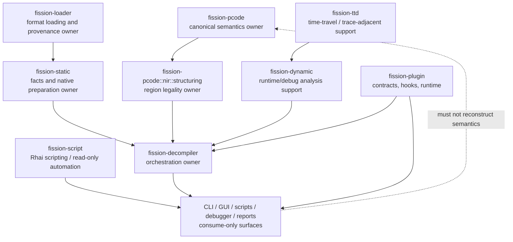
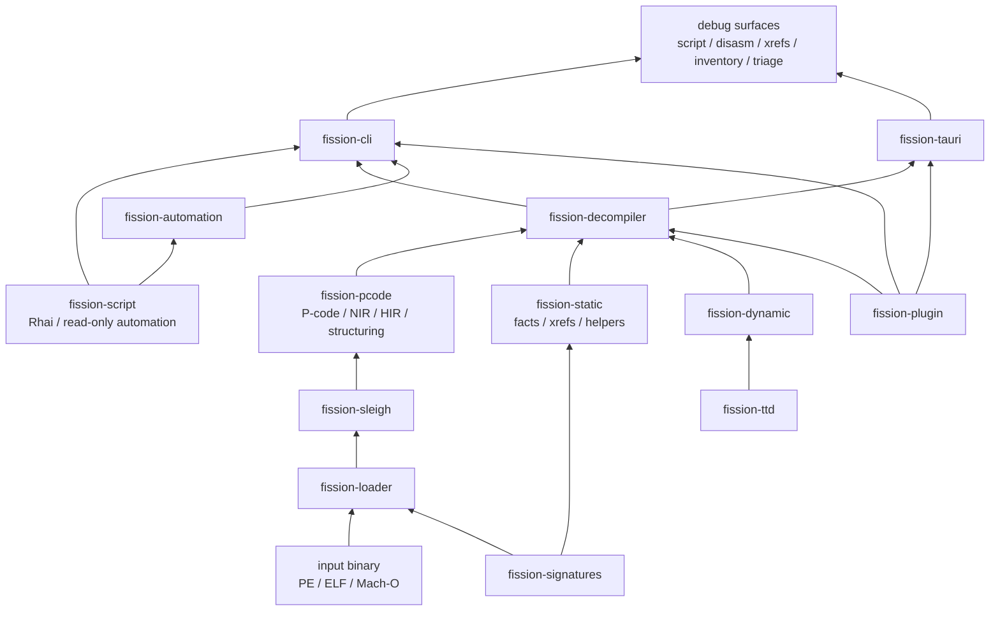
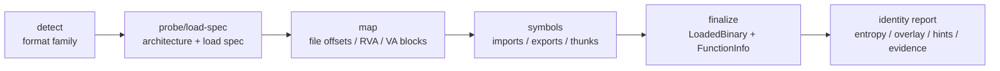
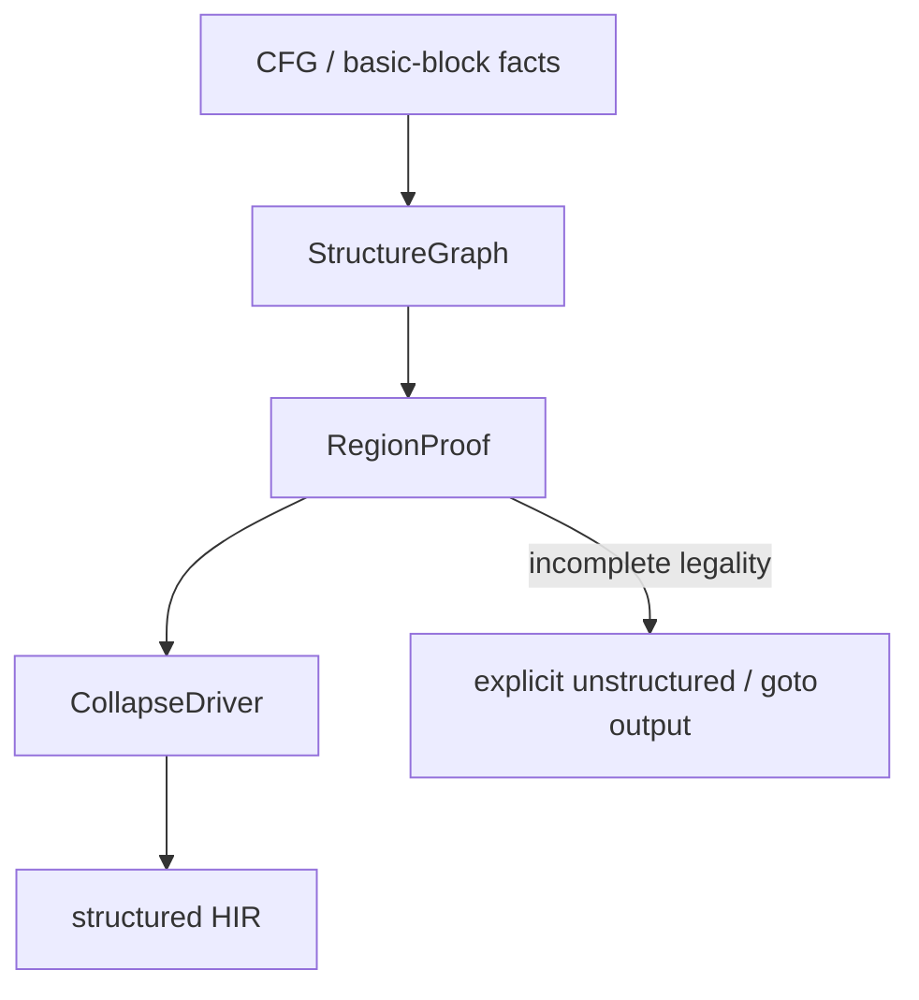
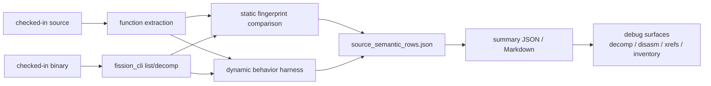

# Architecture Diagrams

This page keeps the high-signal Mermaid diagrams for Fission's architecture and quality workflow. The prose contract remains in [`ARCHITECTURE.md`](./ARCHITECTURE.md); this file is a visual index for quick orientation.

## Ownership Map

## End-to-End Product Surface Map

## Loader Pipeline

## Structuring Pipeline

## Source Semantic Quality Workflow

> [!NOTE]
> Keep diagrams high-level. When a diagram starts encoding policy details, move that policy into prose in `ARCHITECTURE.md` and keep the diagram as an orientation aid.
